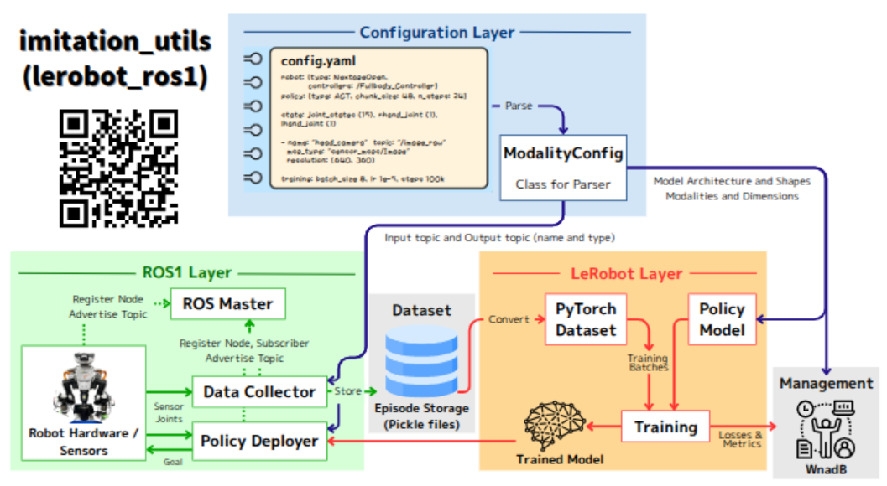

# imitation_utils

[](https://github.com/Michi-Tsubaki/imitation_utils/actions/workflows/CI.yml)

`imitation_utils` provides utilities for robot imitation learning using **ROS1** and **LeRobot** (currently supports **ACT**).
It supports the entire workflow including **data collection, policy training, evaluation, deployment, and visualization**.

### Motivation

Integrating ROS and LeRobot is not straightforward. In ROS, users must explicitly specify topic names and message types. In LeRobot, observation modalities and their dimensions must also be defined in advance.

As a result, even small changes in robot or sensor configuration often require modifying multiple parts of the source code.

### Key Features

- **Dynamic configuration via `config.yaml`**  
  All robot states, sensor modalities, topic names, and message fields are defined in a single configuration file.
  This allows users to add or modify modalities without changing the source code.

- **Seamless ROS–LeRobot integration**  
  The package automatically maps ROS messages to LeRobot-compatible observation structures (e.g., `observation.state`, `observation.images`), enabling direct use of LeRobot policies in ROS environments.

- **Lightweight dataset format using pickle**  
  Standard LeRobot datasets store image data as MP4 files, which introduces encoding overhead during data collection.
  This package introduces a lightweight dataset format based on Python `pickle`, where images are stored directly as NumPy arrays.
  This significantly reduces CPU load and I/O latency, enabling fast data collection even with image-based observations.

- **Dataset conversion and visualization**  
  Although pickle datasets are not directly visualizable, they can be converted to the standard LeRobot format  using `upload.launch`.
  Converted datasets can be visualized with tools such as `rerun` or uploaded to Hugging Face.




## ROS1 installation for Ubuntu22.04
This package only supports python3.10-venv. Python3.10 is Ubuntu22.04 official python3 version. If you are Ubuntu20.04(noetic) user or Ubuntu24.04(ros-o) users, it is ok but install python3.10 and python3.10-venv and manually resolve python package version problems.
```bash
# Configure ROS One apt repository
sudo apt install curl
sudo curl -sSL https://ros.packages.techfak.net/gpg.key -o /etc/apt/keyrings/ros-one-keyring.gpg
echo "deb [arch=$(dpkg --print-architecture) signed-by=/etc/apt/keyrings/ros-one-keyring.gpg] https://ros.packages.techfak.net $(lsb_release -cs)-testing main" | sudo tee /etc/apt/sources.list.d/ros1.list
echo "# deb [arch=$(dpkg --print-architecture) signed-by=/etc/apt/keyrings/ros-one-keyring.gpg] https://ros.packages.techfak.net $(lsb_release -cs)-testing main-dbg" | sudo tee -a /etc/apt/sources.list.d/ros1.list

# Install and setup rosdep
# Do not install python3-rosdep2, which is an outdated version of rosdep shipped via the Ubuntu repositories (instead of ROS)!
sudo apt update
sudo apt install python3-rosdep
sudo rosdep init

# Define custom rosdep package mapping
echo "yaml https://ros.packages.techfak.net/ros-one.yaml one" | sudo tee /etc/ros/rosdep/sources.list.d/1-ros-one.list
rosdep update

# Install packages, e.g. ROS desktop
sudo apt install ros-one-desktop
```
For more information, visit https://ros.packages.techfak.net/ .

## Launch Files Overview

| Launch File | Purpose |
|------------|---------|
| `collect.launch` | Collect sensor and camera data from the robot. |
| `train.launch`   | Train a policy (ACT or Diffusion) using collected data. |
| `eval.launch`    | Evaluate a trained policy on selected episodes. |
| `deploy.launch`  | Deploy a trained policy for real-time robot execution. |
| `upload.launch`  | Convert datasets to lerobot format and upload collected data to a remote repository or storage. |
| `visualize.launch` | Visualize episodes, predicted states, and actions(after upload.launch / lerobot format). |

- I haven't checked diffusion policy.

## Installation & Build
Clone the repository into the `<your_catkin_ws>/src/` directory of your catkin workspace and build:

```bash
# Create workspace if needed
mkdir -p ~/catkin_ws/src
cd ~/catkin_ws/src

# Clone the repository
git clone https://github.com/Michi-Tsubaki/imitation_utils.git

# Build the workspace
cd ~/catkin_ws
rosdep update --include-eol-distro
rosdep install --from-path src -i -r -y
catkin build imitation_utils

# Source the ROS environment
source devel/setup.bash
````

## Usage
Launch the desired functionality using ROS launch:

```bash
# Data collection
roslaunch imitation_utils collect.launch

# Training
roslaunch imitation_utils train.launch config:=path/to/config.yaml

# Evaluation
roslaunch imitation_utils eval.launch config:=path/to/config.yaml episode_index:=0

# Deployment
roslaunch imitation_utils deploy.launch config:=path/to/config.yaml

# Convert your pickle data into lerobot dataset and Upload data to huggigng face hub
roslaunch imitation_utils upload.launch

# Visualization (suports only after upload data into hub)
roslaunch imitation_utils visualize.launch config:=path/to/config.yaml episode_index:=0
```

## Configuration

All robot-specific parameters, topic names, modalities, and policy settings can be adjusted in `config/config.yaml`.
This allows running the same scripts with different robots, cameras, or policies without modifying the code.

### Example Policy Configuration

```yaml
policy:
  type: "act"

  act:
    chunk_size: 100               # Number of frames for temporal chunking
    n_action_steps: 100           # How many actions to predict per forward pass
```

### Example Robot & Modalities Configuration

```yaml
robot:
  fps: 30
  joint_names: ["joint1","joint2","joint3"]
  hand_joint_names: ["hand_r","hand_l"]

modalities:
  state:
    - name: "joint_states"
      topic: "/joint_states"
      msg_type: "sensor_msgs/JointState"
      field: "position"
      dim: 3

  images:
    - name: "camera_head"
      topic: "/camera/head/image_raw"
      msg_type: "sensor_msgs/Image"
      resolution: [64, 64]
      crop: [0.0, 1.0, 0.0, 1.0]
```

> These values are placeholders for illustration. Replace with your actual robot and dataset specifications.
